<!--
  Figures live in src/assets/projects/joystick-voxl/ and are referenced with
  relative paths, so Astro optimizes them and adds your GitHub Pages base path.
  A caption is an italic line straight after an image.
-->

## What I built

A custom RC transmitter. Two industrial joysticks feed an Arduino UNO, which packs their positions into SBUS frames, the serial protocol RC receivers use to talk to a flight controller. A small inverter circuit fixes the signal polarity, and a ModalAI VOXL flight deck reads the result exactly as if it came from an ordinary radio.

## How a stick movement becomes a flight command

1. **Joysticks.** Each axis is an analog voltage, read on the Arduino's A1 to A5 pins as a 10-bit value (0 to 1023).
2. **Arduino UNO.** The sketch scales every reading to the 11-bit SBUS range and packs 16 channels into a frame using the Bolder Flight Systems SBUS library. A frame goes out of the TX pin about every 14 ms.
3. **Signal inverter.** SBUS is an inverted serial signal, and the UNO's UART is not. A hardware inverter sits between TX and the flight deck.
4. **VOXL flight deck.** The frames arrive on the RC input port (J1004), the PX4 autopilot firmware decodes them, and QGroundControl shows the result.

| Control | Arduino input | Channel on the flight deck |
| --- | --- | --- |
| Roll (left, right) | A2 | 1 |
| Pitch (forward, back) | A3 | 2 |
| Throttle | A4 and A5, averaged | 3 |
| Yaw | A1 | 4 |
| Automatic landing button | D4 (toggles) | 5 |

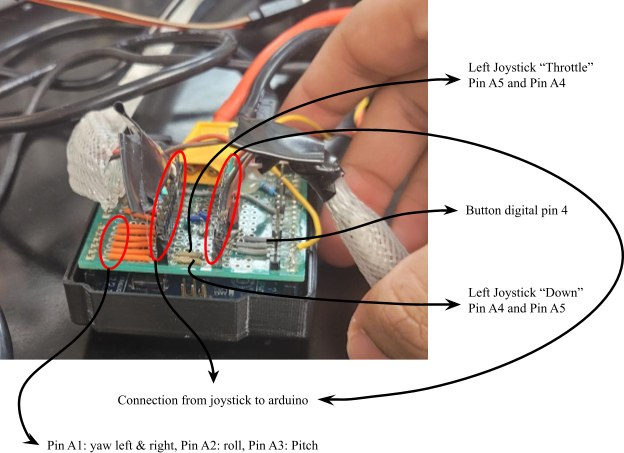

*Pin map: A1 yaw, A2 roll, A3 pitch, A4 and A5 throttle, D4 button.*

The core of the sketch is one `map()` call per axis, then a write:

```cpp
data.ch[0] = map(a2, 0, 1023, 0, 2047);                 // roll
data.ch[1] = map(a3, 0, 1023, 0, 2047);                 // pitch
data.ch[2] = map((a4 + a5) / 2, 0, 1023, 0, 2047);      // throttle
data.ch[3] = map(a1, 0, 1023, 0, 2047);                 // yaw

sbus_tx.data(data);
sbus_tx.Write();
delay(14);                                              // about 70 Hz
```

The SBUS sketch was written with help from an AI assistant (its header says so) and then tested end to end on the bench. Before it, a first sketch thresholded each axis and printed the direction over serial, to map out what each stick movement means.

## The inverter

SBUS uses inverted logic, so a plain UART signal is not accepted. The first version is a single 2N2222 transistor with a pull-up resistor. A later version uses a 7404 hex inverter chip.

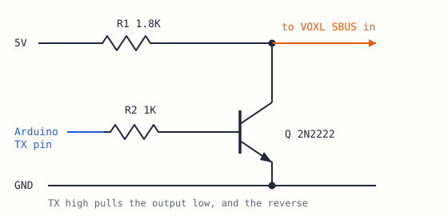

*Transistor inverter, values as in the ArduPilot SBUS output guide.*

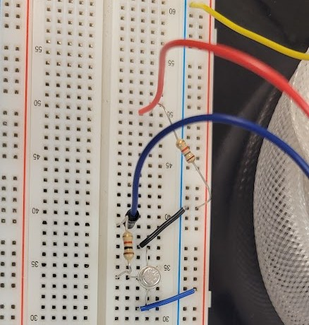

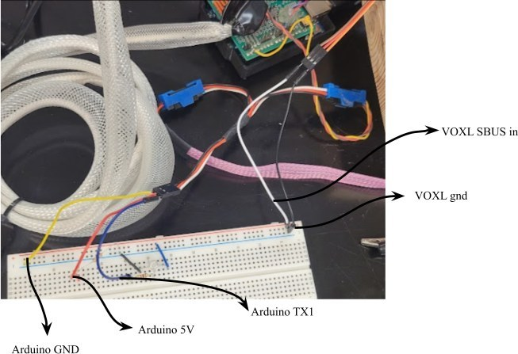

*Arduino 5V, GND and TX1 go into the inverter. Its output goes to the flight deck's SBUS input.*

## Checking the signal on a scope

Before trusting the flight deck, I probed the Arduino's TX1 line with an oscilloscope. Idle sits high and each frame arrives as a burst of pulses. Moving a stick changes the burst.

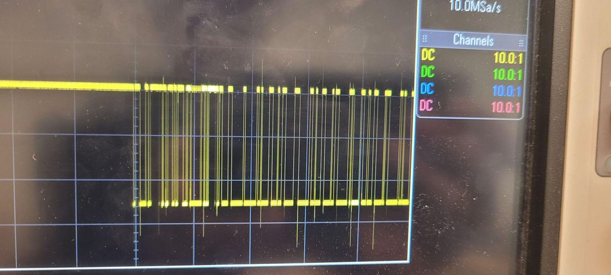

*TX1 at rest.*

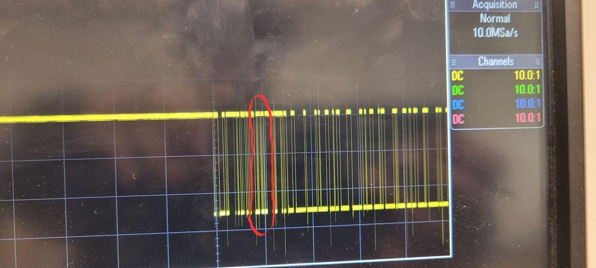

*Throttle moved: the circled part of the burst changes.*

Probing again after the inverter, the waveform flips: the line now idles low, which is the inverted SBUS signal the flight deck expects.

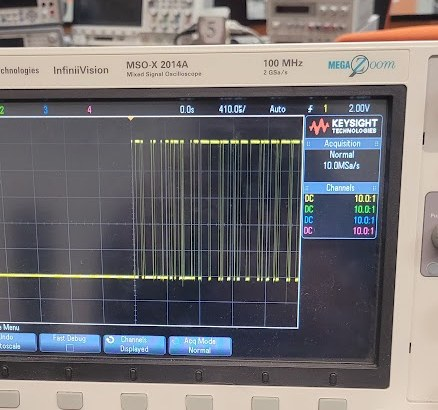

*After the inverter, the waveform is flipped.*

## Reading it on the flight deck

The VOXL is reachable over USB. Three commands open its PX4 shell and print what the RC input is receiving:

```text
adb shell
voxl-px4-shell
listener input_rc
```

Before the inverter, `listener input_rc` only answered "never published", because the flight deck was not receiving any coherent RC input. After it, the channels came alive. At rest they sit near 1513, and each control moves one channel:

| Control | Channel | Change |
| --- | --- | --- |
| Throttle | 3 | 1528 to 2090 |
| Down | 3 | 1528 to 975 |
| Front (pitch forward) | 2 | 1513 to 2089 |
| Back (pitch back) | 2 | 1513 to 937 |
| Right (roll) | 1 | 1512 to 2089 |
| Left (roll) | 1 | 1512 to 935 |
| Yaw right | 4 | 1512 to 2087 |
| Yaw left | 4 | 1512 to 938 |
| Automatic landing | 5 | 1514 to 874 |

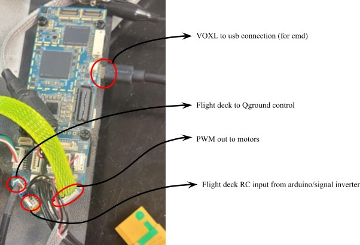

*The flight deck: USB for the shell, RC input from the inverter, PWM out to the motors.*

QGroundControl then showed the controller inputs. At first it did not respond; switching laptops fixed that. With the controls registering correctly, the next step was to take them off the flight deck bench setup and attach them to the drone. There the drone armed in QGroundControl, but without the motors connected and set up, nothing further could be tested.

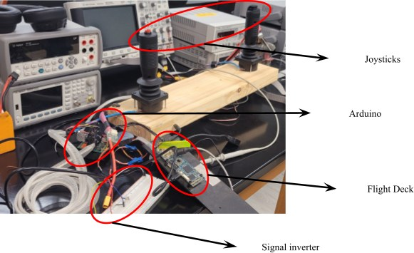

*The full setup on the bench.*

## How it went, week by week

1. **Week 1.** Found misplaced wiring on the RC input and fixed the TX, ground and power lines against the J1004 pinout.
2. **Week 2.** Installed the USB drivers and ADB, and got into the VOXL shell.
3. **Weeks 2 and 3.** The Arduino's plain serial output was not detected, and an FS-i6 transmitter test did not help either. The flight deck turned out to accept only SBUS for RC input. Built the inverter, checked the waveform on the scope, and `input_rc` started returning data.
4. **Week 4.** Debugged and tested with QGroundControl.
5. **Weeks 5 and 6.** Reconnected the drone's existing wiring, designed a holder in Inventor, 3D printed it, and attached electronic speed controllers.

## The drone and the printed holder

A printed module holds the Arduino and the inverter on the drone. It was modeled in Autodesk Inventor to fit the boards, with slots for the connectors and a lid.

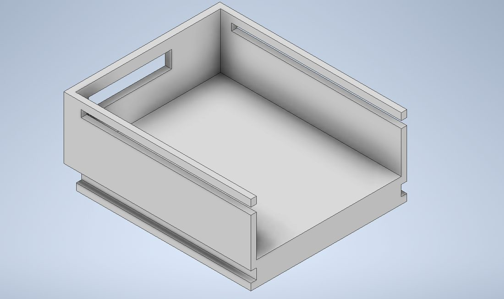

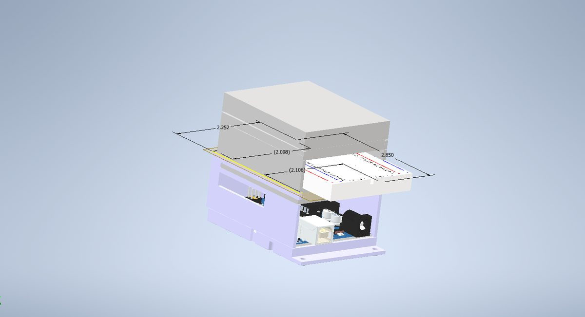

*The holder in Inventor, opened up and exploded.*

The drone already had wiring on it, so the work was reconnecting it: three wires to the motors, three wires from the VOXL's PWM output, and power and ground.

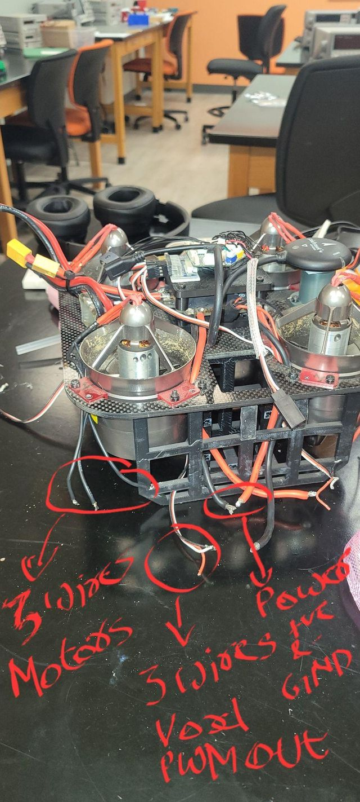 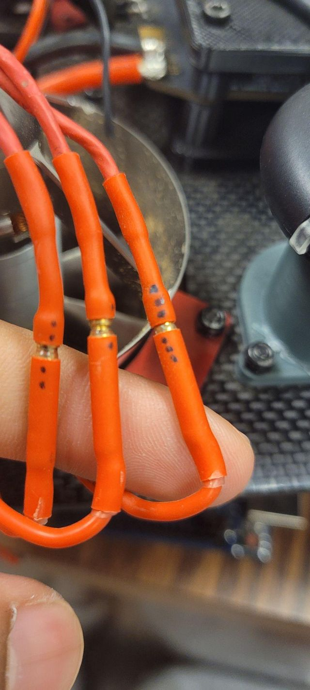

*Reconnecting the drone's existing wiring.*

## Where it stands

The whole chain works up to arming the drone in QGroundControl: joystick, Arduino, inverter, flight deck, ground station. Flight tests with the joysticks are the remaining step.

<!-- TODO: if you have flown it since, replace the paragraph above with what happened. -->

## References

- [ArduPilot: SBUS output circuit](https://ardupilot.org/rover/docs/common-sbus-out.html)
- [Bolder Flight Systems SBUS library](https://github.com/bolderflight/SBUS)
- [ModalAI: VOXL Flight connectors, J1004 RC input](https://docs.modalai.com/voxl-flight-datasheet-connectors/#j1004---rc-input--spektrumsbususart6-connector)
- [ModalAI: setting up ADB](https://docs.modalai.com/setting-up-adb/)
