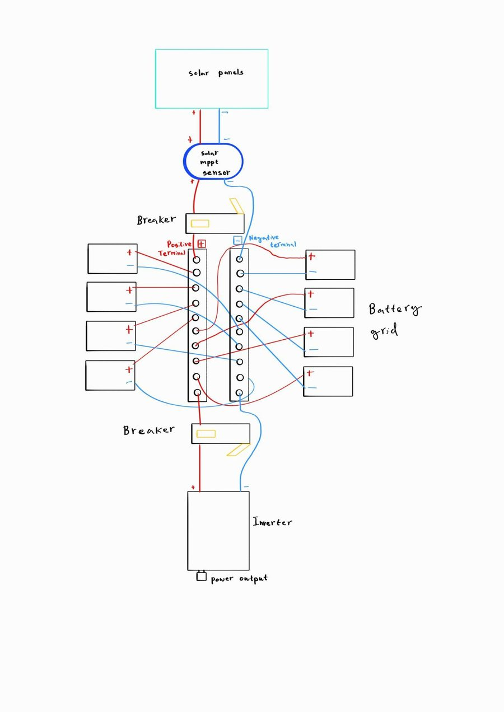
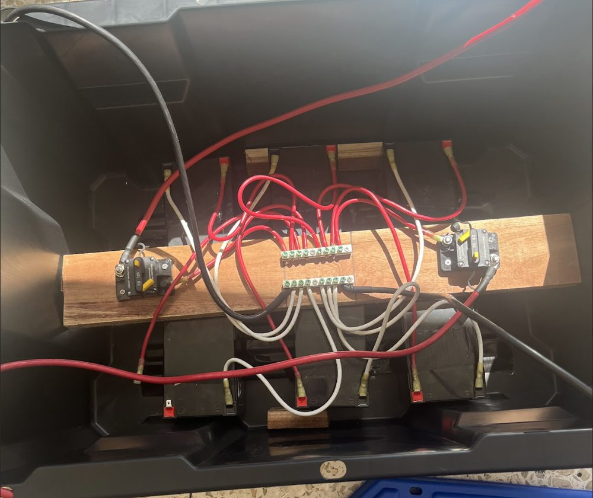
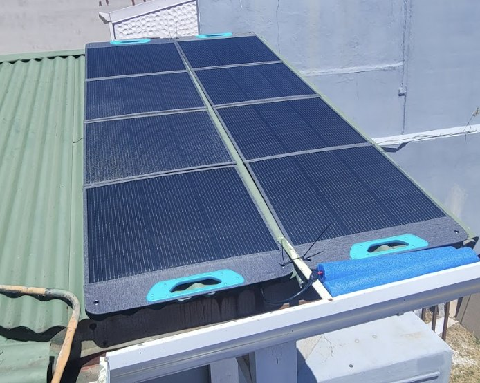
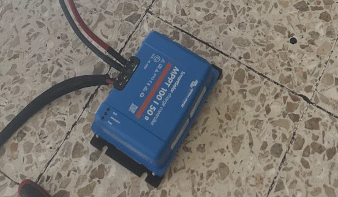
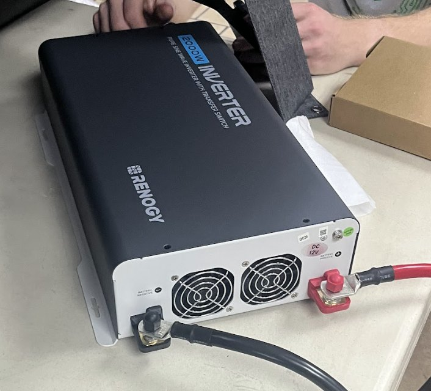

<!--
  TODO: add your LTspice screenshots here, and say which parts of the build were yours.
  Figures live in src/assets/projects/solar-generator/.
-->

## What I built

The engineering behind an off-grid solar system for a community in Costa Rica, designed so the same layout can be repeated at other sites. It was built by a student team as part of the same Costa Rica mission project as the feasibility tool (see the solar feasibility tool case study).

- **Load profiling.** Calculated power load profiles for the community's needs.
- **Solar resource.** Worked with solar irradiance data for tropical field conditions.
- **Simulation.** Modeled circuit behavior in LTspice before anything was built.
- **Replication.** Drafted standardized system schematics so the design is modular and repeatable.
- **The build.** A working portable generator: two 200 W panels, an MPPT charge controller, six lithium batteries behind two DC breakers, and a 2000 W inverter.
- **The manual.** A step-by-step user manual with safety rules, commissioning steps and a maintenance schedule.

*The standardized schematic from the user manual.*

## The parts and what each one does

| Part | Job |
| --- | --- |
| 2 panels, 200 W each | Collect the sun. They are connected together and set where the exposure is best. |
| MPPT solar charge controller | Turns the panel output into a proper charge for the batteries. It pairs with a phone app over Bluetooth. |
| 6 lithium batteries | Store the energy in a battery box. All the positives join on one bus, all the negatives on another. |
| 2 DC breakers | One sits between the controller and the batteries, one between the batteries and the inverter. |
| 2000 W inverter | Turns battery power into AC. The report rates the generator for loads up to about 400 W. |
| Two wire colors | Keep polarity obvious: red for positive, black or blue for negative. |

*The battery box: bus bars in the middle, a breaker at each end.*

 

*The panels and the MPPT controller.*

*The 2000 W inverter with the battery cables on.*

## Putting it together

1. **Battery box.** Join every positive terminal with one wire color and every negative with another. None of the positive wires may touch a negative one. The positive bus then feeds both breakers.
2. **Panels.** Place the two panels where they get the best sun and connect them together. Run their output to the MPPT controller. From the controller, the positive lead goes through the first breaker to the battery positive, and the negative lead goes straight to the battery negatives.
3. **Inverter.** Run the second breaker's output to the inverter's DC input, and connect the inverter's negative to the negative bus. Triple-check polarity.
4. **Commissioning.** Give every wire a tug test, check the voltage at the inverter input with a multimeter, then switch the first breaker on and watch the batteries charge in the app. After that, switch the second breaker on, then the inverter.

Everything except the panels lives somewhere sheltered, which helps the electronics last longer.

## Safety and upkeep

The manual opens with four rules: insulate your tools, take off metal jewelry, never reverse positive and negative, and wear safety glasses and electrical-rated gloves. Upkeep is a schedule:

- **Monthly.** Look over every terminal for heat discoloration and tighten anything loose.
- **Quarterly.** Clean the panels and check the MPPT app for logged battery health errors.
- **Annually.** Check the wiring insulation and make sure no moisture has gotten into the enclosures.

## Field notes: how the two datasets meet

The load profile and the irradiance data feed the same basic sizing relationship:

`array size (kW) ≈ daily load (kWh/day) ÷ (peak sun hours × system efficiency)`

Simulation then checks that the circuit behaves before hardware is committed.
