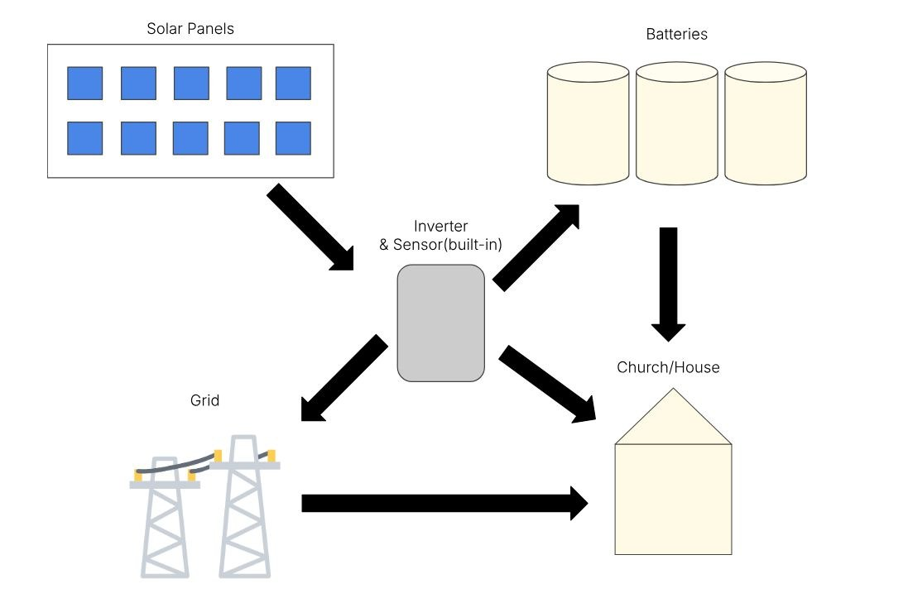
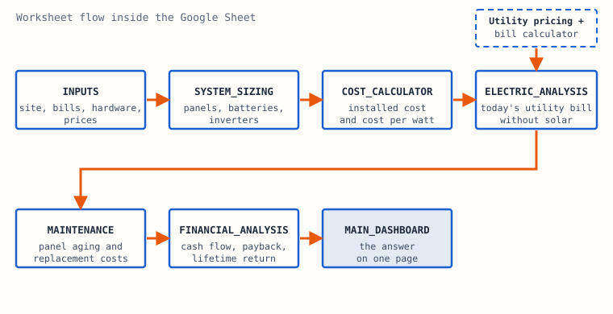
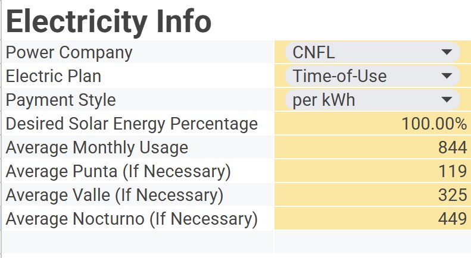
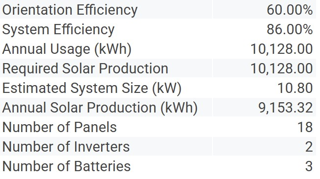
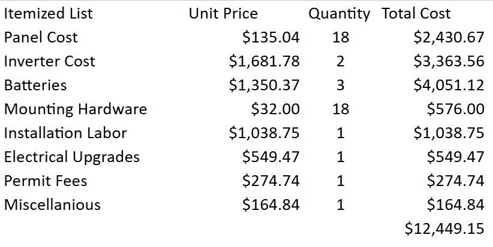
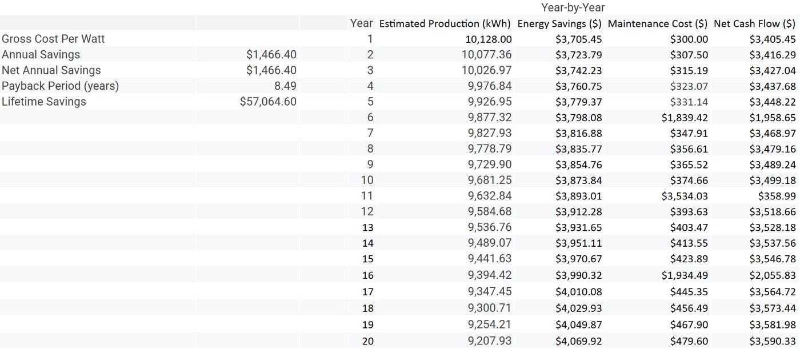

<!--
  TODO: say which parts of the tool were yours (formulas, rates research, testing, the reports).
  Figures live in src/assets/projects/costa-rica/.
-->

## The problem

Ministry sites in Central and South America pay high electricity prices, and the grid is not always reliable. Global Strategies had no repeatable way to judge whether solar would pay off at a given site, so every assessment was done from scratch.

A team of five Anderson University engineering students built the answer: one tool, usable by non-technical people, that takes a site's numbers and returns the ones that matter for a go or no-go decision: installed cost, payback period and lifetime savings. We shared the results in a presentation for Tri-S Costa Rica 2026.

## What the site conditions asked for

- **Roofs.** Many people would rather not have panels on the roof, because walking on it risks leaks. Ground mounts and non-invasive roof mounts had to stay on the table.
- **Heat.** Batteries lose life quickly in high heat, so any design with storage has to deal with it.
- **Theft.** Components need to be secured or placed so they are hard to steal.
- **Upkeep.** Systems should need little maintenance and no special cleaning products.
- **Parts.** Some components cost more when bought locally.

## Choosing the approach

Before building anything, we scored three ideas against weighted criteria: a Google Sheets model, an AI-based algorithm, and a physical solar measurement device.

| Criterion | Weight | Google Sheets | AI algorithm | Physical tool |
| --- | --- | --- | --- | --- |
| Cost-effectiveness | 20% | 5 | 4 | 2 |
| Ease of use | 15% | 5 | 3 | 3 |
| Accessibility | 10% | 5 | 3 | 3 |
| Maintainability | 10% | 5 | 3 | 2 |
| Scalability | 15% | 5 | 5 | 3 |
| Accuracy | 10% | 4 | 4 | 3 |
| Implementation | 10% | 4 | 4 | 4 |
| Data flexibility | 10% | 5 | 5 | 4 |
| **Weighted total** | 100% | **96%** | 78% | 58% |

The spreadsheet won on cost, ease of use and reach: it is low cost, easy to share, and needs no code to use.

## Three kinds of system

The tool models the three configurations a site might choose:

- **Grid-tied.** The simplest and cheapest. Panels power the site, and any surplus goes to the grid for a buyback credit. With no batteries, it cannot run during an outage.
- **Battery.** Independent of the grid, so it keeps running at night and during outages. It needs a bigger array and more storage, so it costs more up front.
- **Hybrid.** Stays on the grid but adds batteries, so it uses solar first, stores extra for peak hours or outages, and draws from the grid only when needed.



*The reference layout: panels, inverter with built-in sensor, batteries, the building and the grid.*

## How the workbook is built

The workbook is nine linked sheets. Data flows one way, from the inputs to a single dashboard.



*Inputs go in at the left, the answer comes out on the dashboard.*

A few of the pieces that do the real work:

- **Roof orientation.** A multiplier scales output by how well the roof faces the sun, aware of which hemisphere the site is in: 1.0 for the ideal direction, 0.9 slightly off, 0.8 for east or west, 0.6 for the opposite direction.
- **Annual production.** The core equation, with panel power, sun hours, orientation, efficiency and shading all included:

```text
annual kWh = (panel W x sun hours x orientation x panels / 1000)
             x 365 x efficiency x (1 - shading)
```

- **Sizing.** The panel count is the energy the user wants to offset divided by what one panel produces in a year, rounded up so it is always a whole panel. Batteries and inverters are sized the same way.
- **Billing.** Today's utility bill is computed the way the local utility does it: tiered blocks, a fixed charge, a flat price per kWh, or time-of-use bands.
- **Aging.** Output falls 0.5% a year for a well-maintained system and 1.5% for a poorly maintained one. Replacement costs for panels, inverters and batteries drop into the right years automatically.
- **Money.** Cash purchase or loan (a payment formula handles the loan), year-by-year cash flow, simple payback as installed cost divided by annual net savings, and lifetime return.



*Part of the inputs sheet. Yellow cells are the inputs.*

## Costa Rican billing, modeled

The tariffs came from CNFL and the other providers we researched. There are two ways a household can be billed.

| Standard residential (block rate) | Price |
| --- | --- |
| Block 1: first 30 kWh | ₡1,744.80 flat (about $4.18) |
| Block 2: 31 to 200 kWh | ₡58.16 per kWh (about $0.14) |
| Block 3: 201 to 300 kWh | ₡89.24 per kWh (about $0.21) |
| Block 4: 301 kWh and up | ₡92.27 per kWh (about $0.22) |

| Time of use | Hours | Up to 500 kWh | 501 kWh and up |
| --- | --- | --- | --- |
| Peak (Punta) | 10:01 to 12:30 and 17:31 to 20:00 | ₡134.62 (about $0.32) | ₡166.46 (about $0.40) |
| Shoulder (Valle) | 6:01 to 10:00 and 12:31 to 17:30 | ₡55.19 (about $0.13) | ₡67.17 (about $0.16) |
| Off-peak (Nocturno) | 20:01 to 6:00 | ₡23.10 (about $0.055) | ₡31.09 (about $0.075) |

Surplus power can be sold back, but at much lower rates than the price of buying it: ₡38.36 per kWh at peak, ₡29.86 at shoulder and ₡21.30 off-peak (roughly $0.09, $0.07 and $0.05). To use buyback, the site connects to the grid: an engineer inspects it, and the utility installs two meters, one for the site and one that records what the panels produce and sends the surplus out.

## Testing it on two real sites

The tool was tried on a church in Alajuelita on a standard flat rate, and on a household on a time-of-use plan.

**The church.** 758 kWh a month costs ₡69,941, or about ₡839,288 a year. Sized to cover all of it:

| Item | Qty | Unit price | Subtotal |
| --- | --- | --- | --- |
| Panel, 600 W | 9 | about $130 | about $1,170 |
| Inverter, 6.5 kW | 2 | about $1,600 | about $3,200 |
| Lithium battery, 12 kWh | 3 | about $1,300 | about $3,900 |
| Labor | 1 | about $1,000 | about $1,000 |
| **Total** | | | **about $9,270** |

**The household.** 818 kWh a month, about ₡623,000 a year. Two designs were compared:

| | Option 1: full coverage | Option 2: hybrid |
| --- | --- | --- |
| Panels, 600 W | 10 | 5 |
| Inverters, 6.5 kW | 2 | 1 |
| Batteries, 12 kWh | 3 | 2 |
| Installed cost | about $9,400 | about $5,850 |
| Bill removed per year | nearly all, about ₡623,000 | about ₡455,000 (73%) |

| Site and design | Cost | Annual savings | Payback in the report |
| --- | --- | --- | --- |
| Church, full coverage | about $9,270 | about ₡839,000 | about 4.6 years |
| Household, option 1 | about $9,400 | about ₡623,000 | about 7.1 years |
| Household, option 2 | about $5,850 | about ₡455,000 | about 5.4 years |

The smaller hybrid paid back sooner than covering everything, because its lower cost outweighed the smaller saving. Full coverage buys more independence from the grid, so the right choice depends on whether the priority is a fast return or energy independence.

These are simple paybacks that assume constant electricity rates and no maintenance costs. The report converts colones to dollars at slightly different rates in different tables. Recomputed entirely in colones, the paybacks are about 5.2, 7.1 and 6.1 years, and the ranking is the same.

## A sample run

The user manual walks through a household using 844 kWh a month. The sizing sheet answers with panels, inverters and batteries, and the cost sheet prices every line.





*For that household: 18 panels (10.8 kW), 2 inverters, 3 batteries, about $12,450 installed.*

The year-by-year sheet then runs the cash flow, including panel aging and replacements, out to a payback of about 8.5 years.



*The cash-flow table behind the payback number.*

## Limits and what comes next

The tool assumes the panels work in ideal conditions: always sunny during the peak hours, constant electricity rates, stable economics and no component failures. Weather, rainy seasons, policy changes and heat losses are not in yet. The next improvements are deducting rainy-season production and adding local differences in solar exposure.

It is handed over as a Google Sheet with a written manual to Global Strategies in San José, where it will help local churches and residents see what solar could save them. It needs a Wi-Fi connection and a Google account. The team documented it in a preliminary design report, a critical design report and a user manual.
