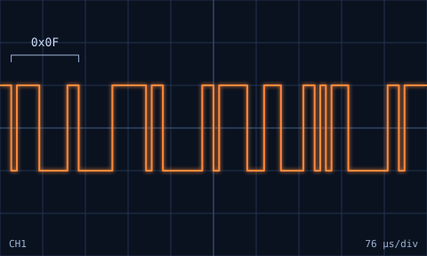

<!--
  TODO: this body renders inside the modal. Add measured results, photos,
  and what you would change next. Images can go in public/images/ and be
  referenced as 
-->

## What I built

A physical test rig for a gyroscope, built during a flight-controls co-op. The work covered the whole chain from the printed hardware to the signal on the wire to the software that displays it.

- **Rig design.** Modeled in Autodesk Inventor and 3D printed to tight tolerances for flight stabilization testing.
- **Telemetry.** A Python tool that shows real-time dynamic motion data from the rig and tracks dynamic controls and flight stability metrics.
- **Signal analysis.** SBUS controller signals captured and decoded on a digital oscilloscope, and the Arduino hardware interfaces debugged with it.
- **Electronics.** Hand-soldered harnesses, Arduino, and ESC integration for power delivery and motor regulation.

## The final version

The finished rig is a set of nested, 3D-printed rings that each turn freely on bearings, so it can be rotated about several axes by hand. The video above shows it moving.

## Field notes: the SBUS frame

SBUS is the serial protocol RC receivers use to hand channel data to a flight controller. These are reference notes on the format, the kind of thing worth having beside the scope.



*An SBUS frame redrawn from its bytes. Every frame opens with 0x0F.*

| Bytes | Contents |
| --- | --- |
| 0 | Header, always `0x0F` |
| 1 to 22 | 16 channels, 11 bits each, packed little-endian |
| 23 | Flags (digital channels, frame lost, failsafe) |
| 24 | Footer, `0x00` |

The line settings are 100 kbaud, 8 data bits, even parity, 2 stop bits, and the signal is inverted. That makes each byte 12 bit-times long on the scope, which is what the trace at the top of the page shows.

```python
# Reference example (not project code): unpack 16 x 11-bit channels.
def decode_channels(frame: bytes) -> list[int]:
    bits = int.from_bytes(frame[1:23], "little")
    return [(bits >> (11 * i)) & 0x7FF for i in range(16)]
```
