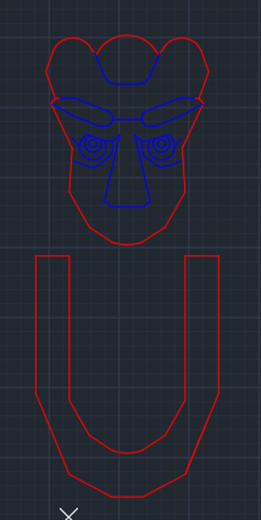
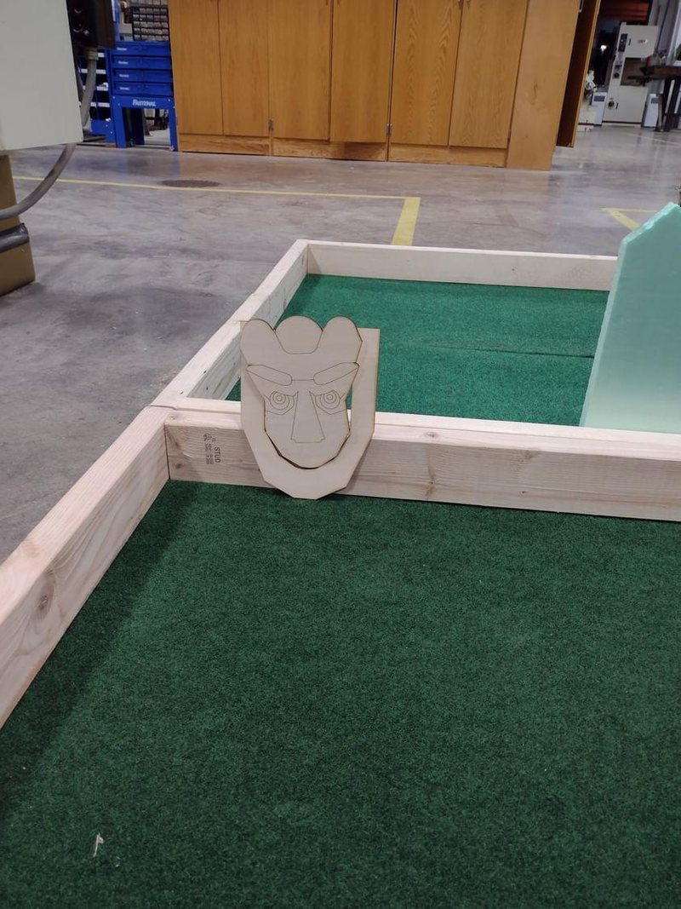
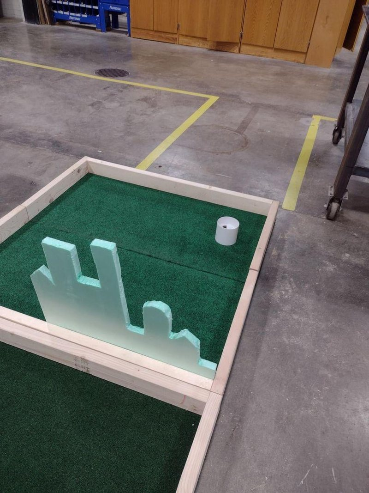
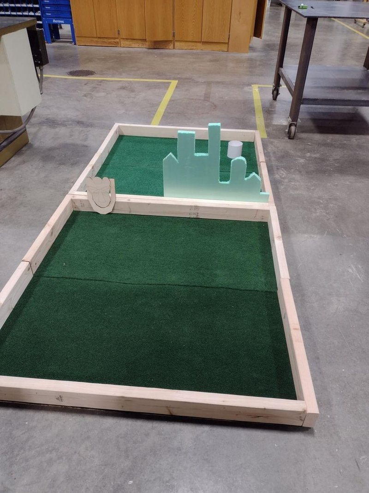

<!--
  TODO: add photos of the finished course with the electronics, and a short video link.
  Figures live in src/assets/projects/putt-putt/.
-->

## What I built

An interactive electromechanical golf course that took second place out of the entire course cohort, themed on The Wizard of Oz.

- **Automation.** Automated door features and dynamic timing mechanisms, controlled by Arduino.
- **Motion.** Electromechanical actuators handle the movement.
- **Fabrication.** Designed in AutoCAD, with parts 3D printed, laser cut and machined in the shop.

A team of four built it for the Engineering 2001 design challenge. Wood-shop training came first, then a wooden prototype, then the electronics.

## The Oz theme

The hole was planned around four features:

- **A moving Oz head** that rises and falls.
- **An Emerald City skyline** as the backdrop.
- **A random ball shoot** that sends the ball out unpredictably.
- **A base** that holds it all together.

The Oz head and the other set pieces were cut on the laser cutter from CAD files.

*The CAD outlines that went to the laser cutter.*

## Iteration 1: the wooden prototype

The first build put the core pieces together in wood, before any electronics went in, so the mechanics could be tested by themselves. Each feature ran into a problem, and each got a fix:

| Feature | Problem | Fix |
| --- | --- | --- |
| Moving Oz head | Uneven friction made the vertical motion rough and inconsistent | Adjusted the alignment and lubricated the moving parts |
| Emerald City skyline | Keeping it stable without getting in the way of play | Reinforced the supports and moved it |
| Random ball shoot | The ball moved inconsistently because of uneven angles on the surface | Redesigned the ramp with smoother inclines, with testing continuing |
| Base layout | Lining components up so they fit together later | Used precise measurements and adjusted the layout for the features still to come |

 

*The Oz head and the Emerald City skyline.*

*The whole prototype on the shop floor.*

## What came next

At the time of that progress report the next steps were to refine the prototype from its first tests, plan the motorized Oz head and the automated ball shoot, add the aesthetic details (poppy bushes and a yellow brick road), and keep testing durability and gameplay flow. The Arduino-controlled doors and timing mechanisms in the final course came out of that electronics stage.
