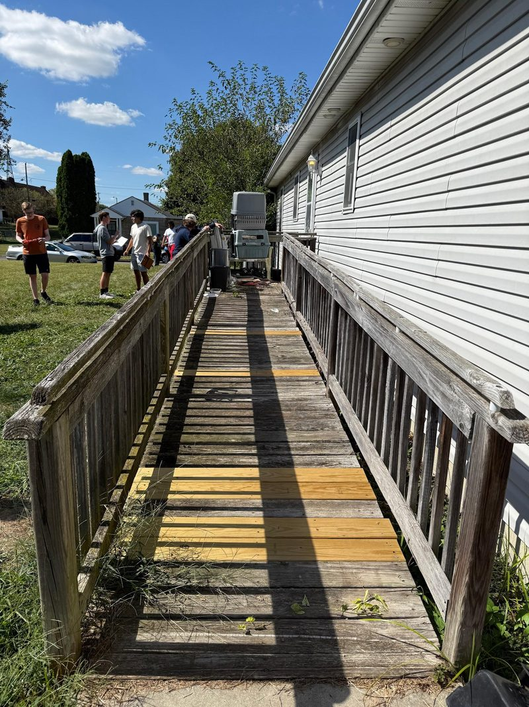
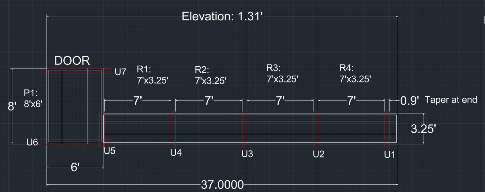
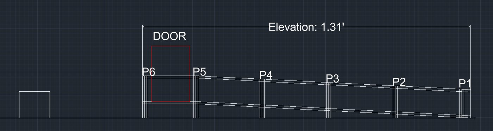
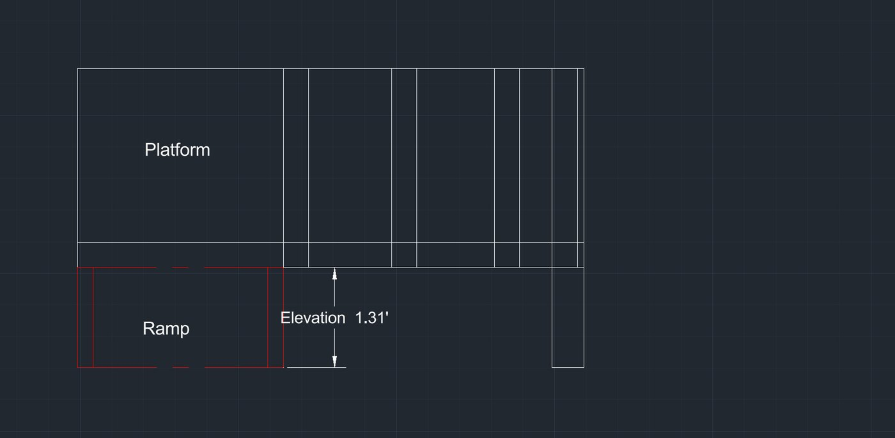
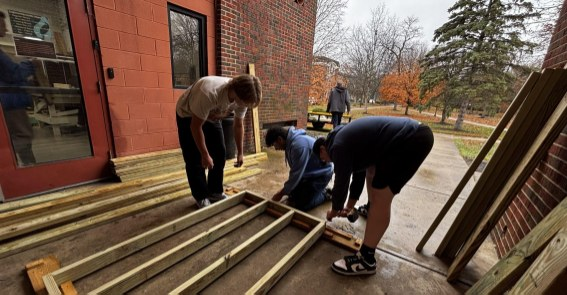
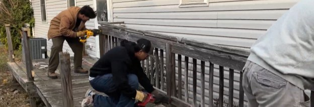

<!--
  Figures live in src/assets/projects/saws-ramp/. The homeowner and volunteers are
  deliberately not named on the site.
-->

## What I did

Servants at Work (SAWs) builds wheelchair ramps for homeowners. In this course our team took one ramp from the first site visit to a full design, and I also volunteered on three build weekends. On our design team I was the project manager.

## The site evaluation

We visited the home with the homeowner's permission and measured the ramp, patio and doorway with an optical level and a tape measure.

| What we measured | Result |
| --- | --- |
| Back door, the main entrance | 3 ft wide, 1 in inside threshold, no steps out |
| Landing outside the door | about 6 ft by 8 ft |
| Door to the ground | about 1.6 ft |
| Sidewalk joining the ramp | 4 ft wide, with about 1.3 ft of elevation change from the end of the ramp to the top of the sidewalk |
| Existing ramp | old, usable, and due to be replaced |
| Front door | the alternate entry: 3 ft wide, six steps, about 4 ft of total rise |
| Obstacles | none; an air conditioner is nearby but clear of the work |

The homeowner added one requirement on the spot: extend the patio by about 2 ft in each direction so a wheelchair can turn around.

*The old ramp we were replacing.*

## The rules the ramp has to meet

- The slope is no steeper than 1:12: one inch of rise for every 12 inches of length.
- The clear width is at least 36 inches.
- A continuous section may rise no more than 30 inches before a landing.
- Handrails on both sides, 34 to 38 inches high, and 2-inch edge protection.
- The top of the ramp lands within half an inch of the door threshold.
- The surface is stable, firm and slip-resistant.

At 1:12, the site's rise of about 1.6 ft called for a ramp of 19 to 20 ft, which set the minimum length.

## The design

Our design met or beat every rule. The elevation change is 1.31 ft, so the ramp runs at roughly half the steepest slope the standard allows.

*Top and side views, drawn in CAD.*

- **Platform.** 8 ft by 6 ft, so there is room to turn and the air conditioner stays out of the way.
- **Ramp.** About 29 ft, built as four 7 ft sections plus a short taper at the end for a smooth transition to the ground. Sections are easier to build, carry and install than one long piece. The overall length, platform included, is 37 ft.
- **Width.** 3.25 ft, or 39 inches, before the guardrails go on.
- **Railings.** 36 inches tall, with edge protection built in.
- **Supports.** Seven supports, U1 to U7, spaced 7 ft apart, with extra ones near the platform.
- **Materials.** 2×4 and 2×6 lumber and deck boards, fastened with screws.
- **Prefab list.** Five frames: one platform and four ramp sections. Estimated cost of the ramp was $1,132.94, and the total load about 2,389 lb.

**Safety plan.** Call 811 before any digging so underground utilities get marked, which mattered because soil had to come out for pea gravel near the foundation and the gas meter. Everyone wears PPE, only adults run power tools, and a stocked first-aid kit stays on site.

## Build days

The builds worked as prefab days and installation days: lumber gets sorted, cut and assembled into frames one afternoon, then carried out and installed the next morning. I worked three builds in November 2025, for 14 hours against a goal of 8.

| Date | Kind | What I did | Hours |
| --- | --- | --- | --- |
| Nov 7 | Prefab | Sorted lumber, cut deck boards, assembled frames | 1.5 |
| Nov 8 | Install | Helped remove an old cemented fence, then laid deck boards | 4 |
| Nov 14 | Prefab | Organized lumber, cut wood for the U-eyes | 3 |
| Nov 15 | Install | Cut out the old ramp, then placed platforms | 4 |
| Nov 21 | Prefab | Sorted lumber, cut tapers, loaded the trailer | 1.5 |
| **Total** | | | **14** |

 

*Building platform frames on a prefab day, and cutting out an old ramp on an install day.*

A few things from the installs:

- **Getting the fence out.** The old fence posts were cemented in far deeper than expected. Digging around them did not work, and a 12 ft piece of lumber used as a lever did.
- **Setting a platform.** Each platform is leveled first, then checked for plumb, then fastened at the U-eyes with a screw pattern before we move to the next one.
- **Surprises on site.** When the first platform went in, we found a dryer vent in the wall that the plans had missed, and the platform had to be adjusted around it.
- **The taper.** The end of the ramp had to be dug in for the taper to fit, and then bedded in pea gravel.
- **Finishing.** Railings screwed on and sanded, then blown clean. One of the finished ramps was rated 9 out of 10.

## What I learned

I assumed all the 12 ft boards were the same length. They were not, and some deck boards came out a little long. It was easy to fix the next day, but it taught me to check measurements and materials before cutting instead of assuming. I also learned how much faster a team moves when everyone helps, and how useful leverage is on a job like pulling a cemented post.
