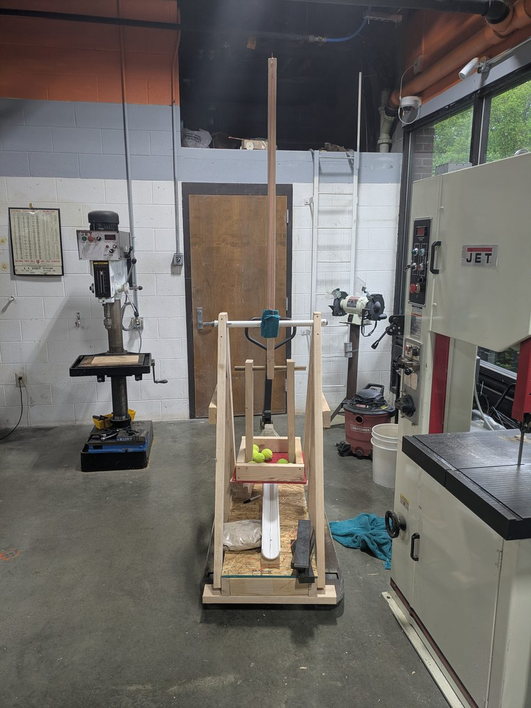
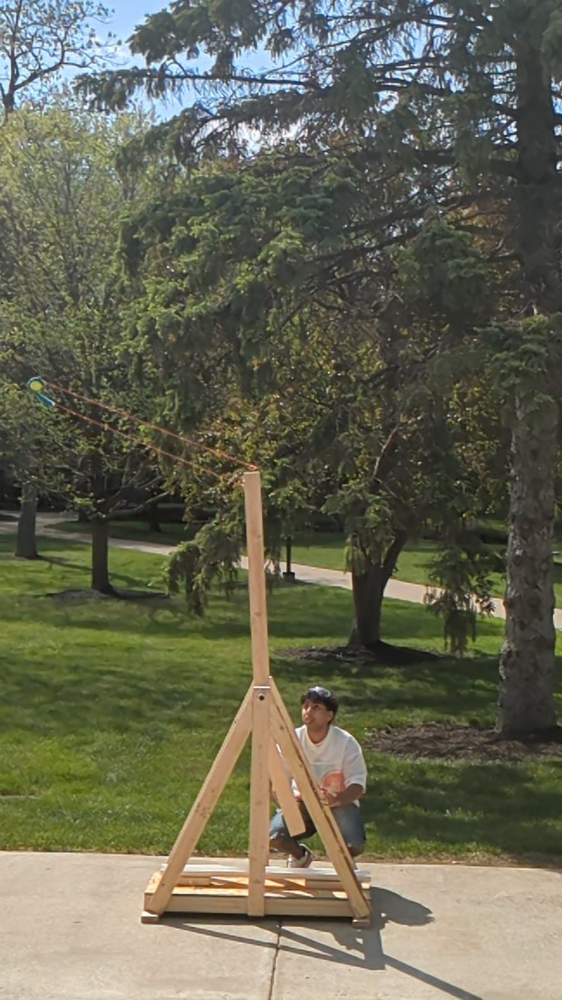
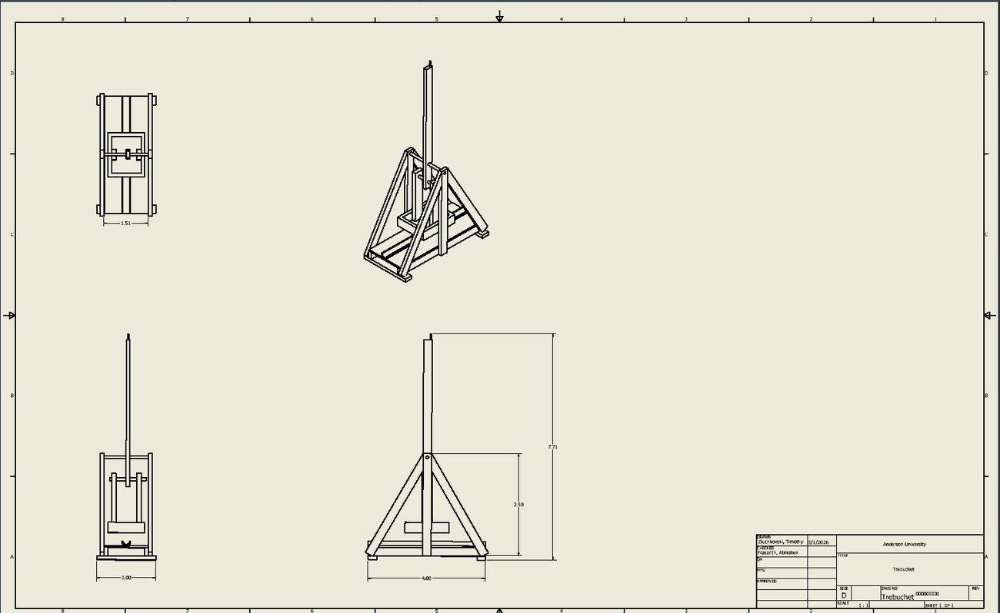
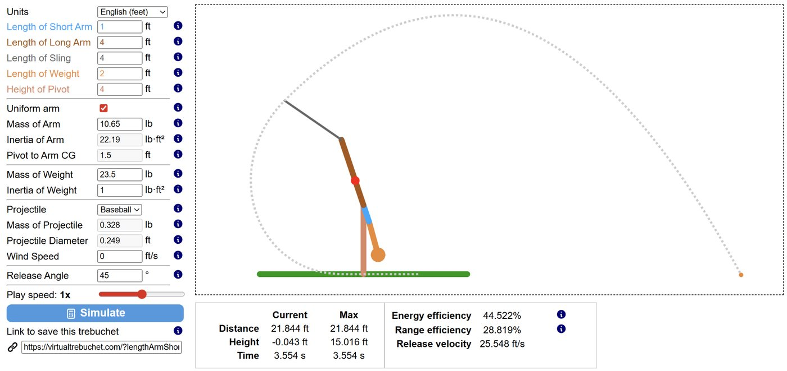

<!--
  Figures live in src/assets/projects/trebuchet/.
-->

## What I built

A trebuchet that throws a tennis ball at a chosen distance: 25, 50, 75 or 100 feet. We built it as a two-person team for a dynamics course, and the goal was not only to reach the distances but to hit them accurately. The work ran from choosing the design, through a physics model that predicts how much counterweight each distance needs, to building it and measuring how close the model came.

 

*The finished machine in the shop, and a launch on test day.*

## Choosing the design

Three launcher types were scored against five criteria. The trebuchet won on accuracy control and looks, and tied the catapult on full-scale build and ease of calculation.

| Design | Easy to prototype | Easy to build full scale | Accuracy control | Aesthetics | Easy to calculate | Total |
| --- | --- | --- | --- | --- | --- | --- |
| Catapult | 5 | 4 | 3 | 3 | 4 | 19 |
| **Trebuchet** | 3 | 4 | 5 | 5 | 4 | **21** |
| Ballista | 2 | 1 | 3 | 5 | 3 | 14 |

A trebuchet is harder to prototype than a catapult, but its consistency and predictability made it the better choice for a project built around prediction. Before cutting full-size lumber, we built a 1:12 scale prototype from laser-cut basswood that launched mini marshmallows.



*The drawing sheet for the full-scale design.*

| Dimension | Value |
| --- | --- |
| Throwing arm | 5 ft pine 2×4 |
| Short arm and long arm | 1 ft and 4 ft (a 4:1 ratio) |
| Sling | 4 ft |
| Effective throw radius | 8 ft (long arm plus sling) |
| Base | 2 ft × 4 ft |
| Counterweight drop height | 4 ft |
| Projectile | tennis ball, 58 g |

## The physics

The counterweight's stored energy turns into arm rotation and finally into the ball's speed. Only part of it makes it there: some goes into swinging the heavy wooden arm, some into the counterweight itself, and some into pivot friction and the sling, so the model carries an efficiency factor of about 0.35. Working backward from a target distance gives the counterweight:

```text
launch speed      v = sqrt(R g / sin 2θ)        release angle θ = 45°
arm speed         ω = v / R_eff                 R_eff = 4 ft + 4 ft = 8 ft
energy balance    η m_c g h = ½ I_arm ω² + ½ m_c L_s² ω² + ½ m_p R_eff² ω²
```

For a 25 ft target that means a launch speed of 28.4 ft/s and an arm speed of 3.55 rad/s, which the energy balance turns into a counterweight of about 22 lb. The same steps give the other distances:

| Target | Launch speed | Arm speed | Predicted counterweight |
| --- | --- | --- | --- |
| 25 ft | 28.4 ft/s | 3.55 rad/s | 22 lb |
| 50 ft | 40.1 ft/s | 5.02 rad/s | 43 lb |
| 75 ft | 49.2 ft/s | 6.14 rad/s | 67 lb |
| 100 ft | 56.7 ft/s | 7.09 rad/s | 93 lb |

We checked the model against the Virtual Trebuchet simulator using the same arm and sling lengths. It agreed with the hand calculation: a counterweight of about 22 lb was enough for the 25 ft shot.



*A simulator run with the final geometry: a 23.5 lb counterweight lands about 22 ft out.*

## Testing it

Each distance got five trial shots. For the three longer distances, the counterweights that worked in practice were lighter than the predicted ones, because the model leaves out air resistance, friction and arm sway. Those were the effects we tried to correct for: the axle became a metal rod to cut friction, and shaft collars held the arm in place against sway.

| Target | Counterweight used | Average distance | Accuracy |
| --- | --- | --- | --- |
| 25 ft | 25 lb | 23.2 ft | 92.8% |
| 50 ft | 38 lb | 47.8 ft | 95.6% |
| 75 ft | 50 lb | 70.4 ft | 93.9% |
| 100 ft | 70 lb | 94.8 ft | 94.8% |

Accuracy here is the average distance divided by the target. The five trials at 100 ft ranged from 90 ft to 105 ft.

## The in-class test

The first three shots landed close to what testing had predicted. Then, before the 100 ft shot, the knot holding the release at the top of the arm came undone, and everything we had calibrated was thrown off. We used our redo on the 100 ft shot and landed 40 ft off, and the counterweight was also lighter than the predicted mass.

## What I learned

- **Do not gamble.** Before using the redo we were only 7 ft from the goal. Changing the weight on a guess undid a good result.
- **Real machines do not match the calculations.** The prediction was a good starting point, and testing did the rest.
- **Check the small parts.** Reapply adhesives, and burn the ends of knots or glue them so they cannot come undone.
- **Shop skills.** Building it meant learning the machines in the engineering center, including welding, the plasma cutter and the metal band saw.

If I built it again, the PVC shaft collars would change: either a different material, or the arm glued to a pipe that turns around the bar.
